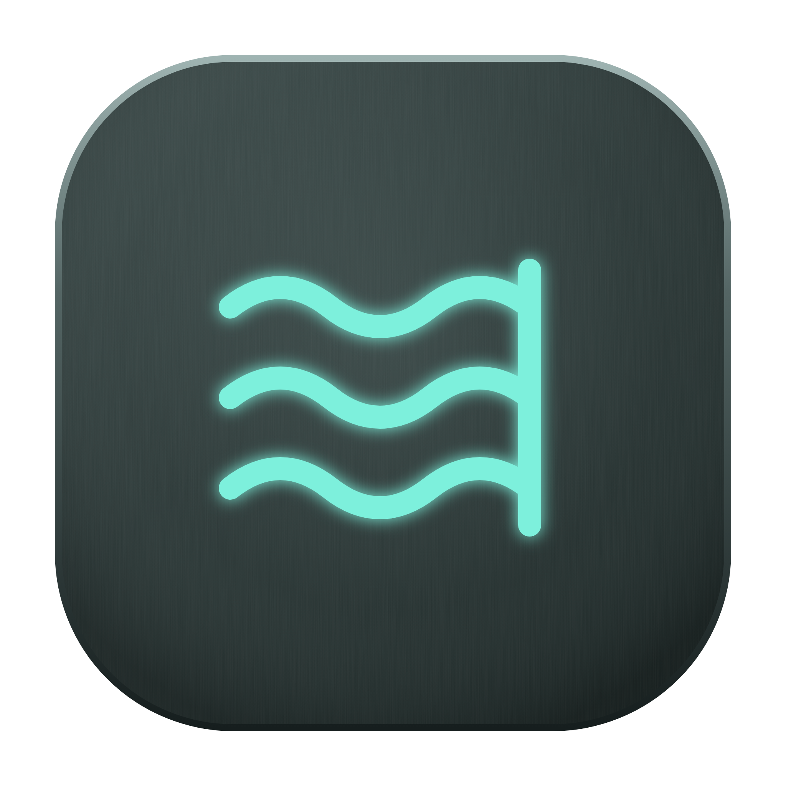
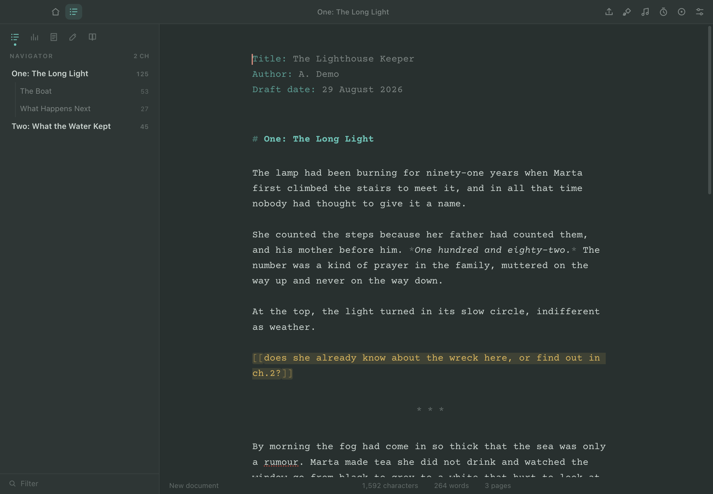
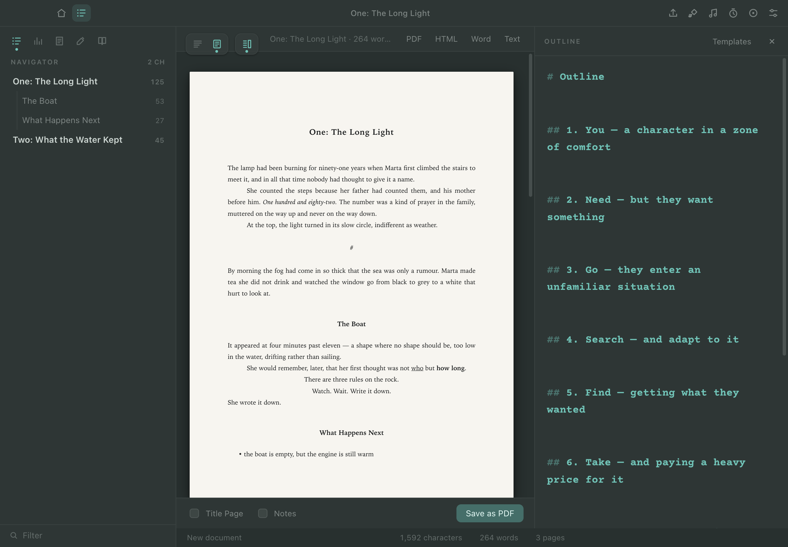
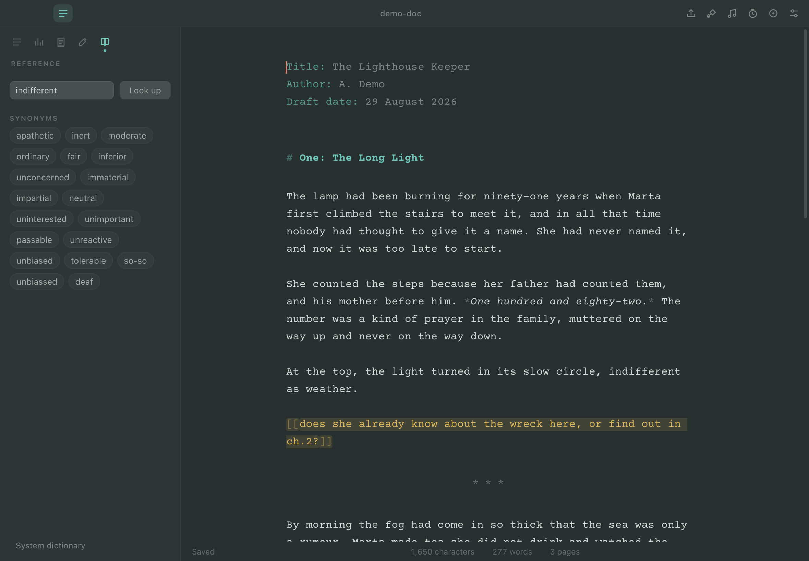
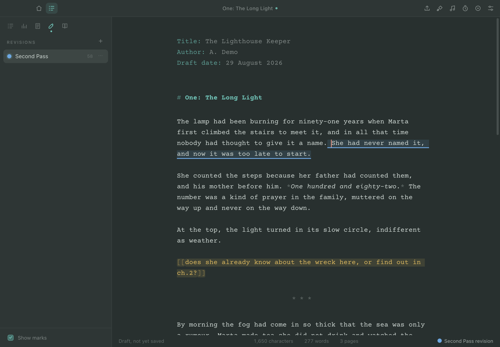
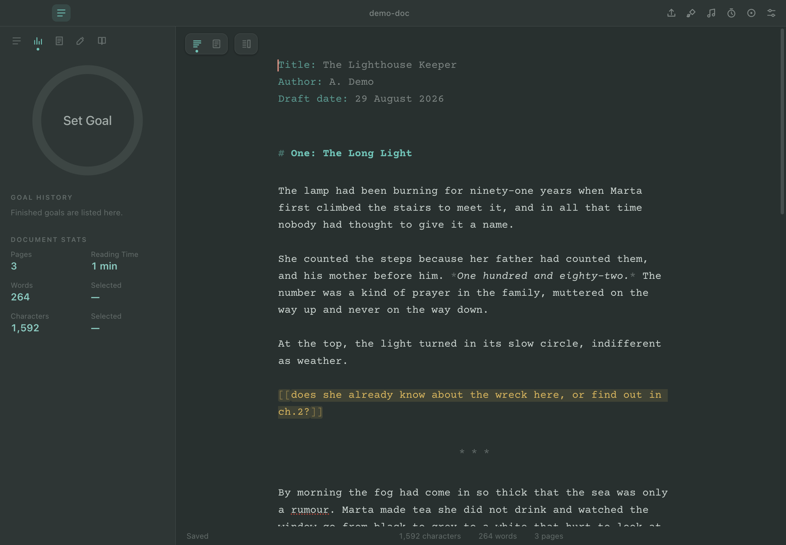
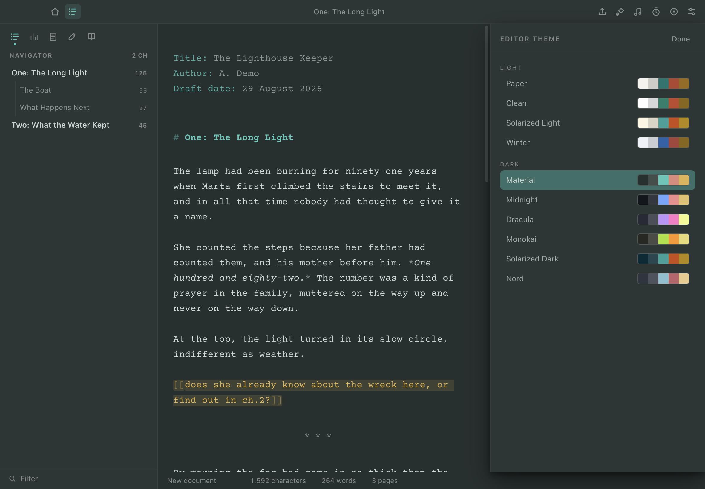

<p align="center">
  
</p>

<h1 align="center">Low Tide</h1>

<p align="center">A novel writing app that keeps you in the room.</p>

Writing goes wrong when you leave to look something up. You open a browser for a
synonym, glance at your outline in another window, put music on — and the thread
is gone. Low Tide puts all of it inside the app: your outline beside the page, a
dictionary and thesaurus in the sidebar, music in a pane, notes where you're
working. Nothing asks you to tab away.

The name is the promise. The tide is out; there's no water here to fall into.

Your document stays a plain `.fountain`, `.txt` or `.md` file the whole time.
No database, no lock-in, readable in any other editor.



## Install

### Download

Take the file for your machine from
[Releases](https://github.com/hrozno2/lowtide/releases).

| System | File |
| --- | --- |
| macOS, Apple silicon | `LowTide-1.0.3-mac-arm64.dmg` |
| macOS, Intel | `LowTide-1.0.3-mac-x64.dmg` |
| Windows | `LowTide-1.0.3-win-x64.exe` (or `-arm64`) |
| Linux, any distro | `LowTide-1.0.3-linux-x86_64.AppImage` |
| Arch, CachyOS, Manjaro | `LowTide-1.0.3-linux-x64.pacman` |

- **macOS** — open the `.dmg`, drag it to Applications.
- **Windows** — run the `.exe`.
- **AppImage** — `chmod +x` it and run it. Nothing to install.
- **Arch** — `sudo pacman -U LowTide-1.0.3-linux-x64.pacman`

The builds are not notarised, so the first launch needs a nudge: on macOS
right-click the app and choose **Open** (double-clicking will refuse); on
Windows choose **More info → Run anyway**.

### Or build it

```bash
git clone https://github.com/hrozno2/lowtide.git
cd lowtide
npm install
npm start
```

To make installers yourself:

```bash
npm run dist:mac      # .dmg + .zip            (Apple silicon + Intel)
npm run dist:win      # installer              (x64 + arm64)
npm run dist:linux    # AppImage, pacman, tar.gz
```

Each has to run on that platform, or in CI.

## What's in it

**Writing.** Plain text with live styling — headings, emphasis, notes and
comments are coloured as you type, and the markup characters stay visible so the
page never reflows under your hands. Smart quotes, em dashes and ellipses.
Spellcheck with right-click corrections; choose your dictionaries in Preferences.

**Structure.** The Navigator lists every chapter and section with its word
count, filters as you type, and jumps you there. Nesting is drawn with one rule
per level, and dragging a chapter reorders the manuscript — the text goes with
it, scenes and all.

**Outline.** A second editor beside the manuscript, opened and closed with one
button and resizable by dragging. Start from three-act, Dan Harmon's story
circle, the hero's journey, seven-point, Freytag, a chapter grid, or blank. Each
outline belongs to its document and stays open in both the text and pages views.



**Reference.** Definitions, synonyms and antonyms in the sidebar. Click a
synonym to swap it into your prose. On macOS the system dictionary is one click
away and works offline.



**Music.** Play audio files from your machine, or browse YouTube in a pane,
scaled down to suit it. Closing the pane hides it rather than stopping it, so
whatever is playing keeps playing. YouTube can be switched off entirely.

**Scratchpad.** Notes about the document, kept with it, never printed or counted.

**Revisions.** Name and colour a revision; everything you type while it is
selected is marked in that colour, and the marks follow the text through later
edits. Any revision can be hidden, applied (keep the text, drop the colour),
reverted (delete what it added), or removed.



**Goals and stats.** One goal at a time — new words, new pages, total words or
total pages. Meet it, press Done, and it drops into the history. Alongside it:
pages, reading time, words, characters, and counts for whatever is selected.
Sprints run a countdown with an optional word goal.



**Focus.** Focus Mode dims everything but the paragraph or line you are on.
Typewriter scrolling keeps the caret centred.

**Preview and export.** Real page breaking — the manuscript is laid out
offscreen at print geometry and cut where the lines actually fall, so the page
count is the true one. Export to PDF, Word (`.docx`, written directly rather
than HTML in disguise), Markdown, plain text or HTML, with an optional title
page.

**Nothing gets lost.** Saves are atomic, so a crash cannot truncate your file.
Autosave fires when you pause and at least every 15 seconds while you keep
typing. Every save keeps a version, and `File ▸ Revert to Backup` opens any of
them in a new window. Unsaved drafts survive a restart. `File ▸ Move to Dropbox`
moves a document into Dropbox with its outline, scratchpad and revisions intact.

**Updates.** On launch it asks GitHub whether a newer release exists and, if so,
shows a dismissible notice with a download link. It never installs anything by
itself, and the check can be switched off in Preferences.

**Make it yours.** Nine themes, light and dark. Typeface, size, line spacing,
column width, page size, margins and print leading are all adjustable, and the
toolbar buttons can be reordered or switched off.



## The markup

| You write | You get |
| --- | --- |
| `# Chapter One` | Chapter — appears in the Navigator |
| `## Scene` / `### Beat` | Section, sub-section |
| `**bold**` `*italic*` `***both***` | Emphasis |
| `_underline_` `~~struck~~` | Underline, strikethrough |
| `[[a note to self]]` | Note — never printed, never counted |
| `/* … */` | Comment — hidden from the manuscript |
| `---` or `===` | Page break |
| `***` | Scene break |
| `> centered <` | Centered line |
| `- item` | Bulleted list |

A `Key: Value` block at the top of the file (`Title:`, `Author:`,
`Draft date:`) becomes the title page and is left out of the word count.

## Keyboard

| | |
| --- | --- |
| `⌘/Ctrl 1 2 3` | Chapter, Section, Sub-section |
| `⌘/Ctrl B I U` | Bold, italic, underline |
| `⇧⌘/Ctrl C` | Centre the line |
| `⇧⌘/Ctrl N` | Wrap in a note |
| `⌘/Ctrl F` | Find |
| `⌥⌘F` / `Ctrl H` | Find and replace |
| `⌘/Ctrl J` | Go to chapter |
| `⇧⌘/Ctrl L` | Navigator |
| `⇧⌘/Ctrl U` | Outline |
| `⇧⌘/Ctrl D` | Dictionary and thesaurus |
| `⇧⌘/Ctrl M` | Music |
| `⇧⌘/Ctrl E` | Pages view |
| `⇧⌘/Ctrl F` | Focus Mode |
| `⇧⌘/Ctrl T` | Typewriter scrolling |
| `⇧⌘/Ctrl R` | Sprint |
| `⌘/Ctrl E` | Export |
| `F1` | Markup cheat sheet |

## Notes

- Page counts come from a real layout rather than a words-per-page guess. Page
  size, margins, type size and leading are all adjustable.
- The PDF's running head is drawn by Chromium's print engine, which puts it on
  every page, including a title page. The on-screen preview is exact.
- The dictionary queries dictionaryapi.dev and datamuse.com. Only the single
  word is sent, the request comes from the main process rather than the editor,
  and the feature can be switched off.
- The music pane shows YouTube's own site. Taking only the audio is against
  their terms, so it is not done; use local files if you want sound with nothing
  to look at. There is no Spotify tab — its web player needs DRM that Electron
  does not ship.

## Development

```bash
npm run watch       # rebuild the renderer as you edit
npm test            # 108 unit and 241 end-to-end checks
npm run pack        # unpacked build, the quickest packaging check
```

```
src/main/          windows, menus, file IO, PDF and Word export
src/renderer/js/   markup, decorations, pagination, parse, editor, app
src/renderer/css/  theme.css holds every palette token
```

## Licence

MIT — see `LICENSE`. Everything bundled is permissively licensed, with the full
text in `THIRD-PARTY-NOTICES.md`. CodeMirror, Electron, esbuild and
electron-builder are MIT; Courier Prime is under the SIL Open Font License and
is redistributed unmodified.

Every icon, style and string here was written for this project; it is not
derived from any other application's code or assets. Fountain is an open syntax.
