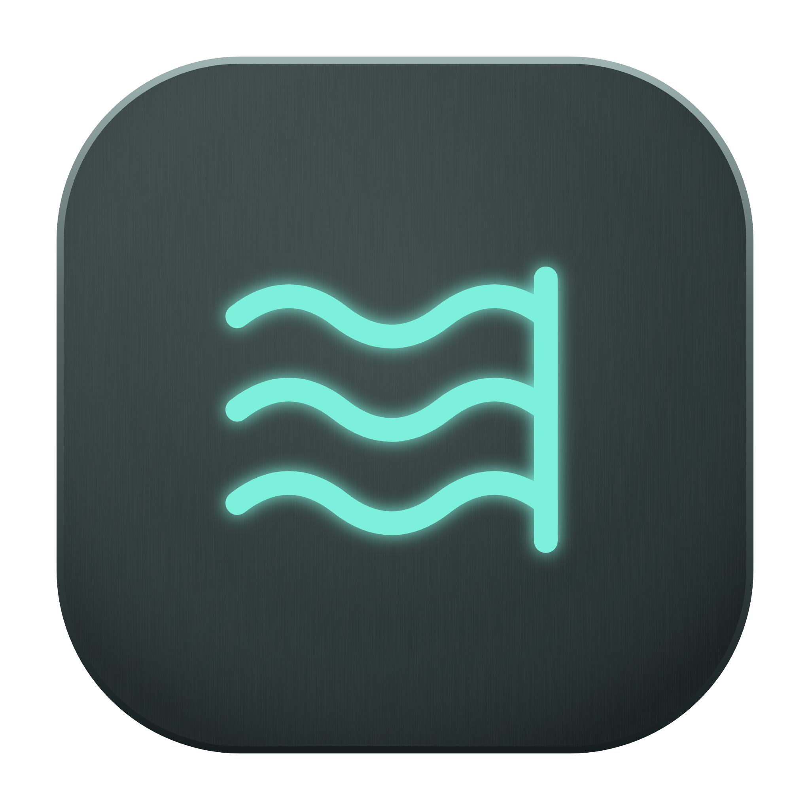
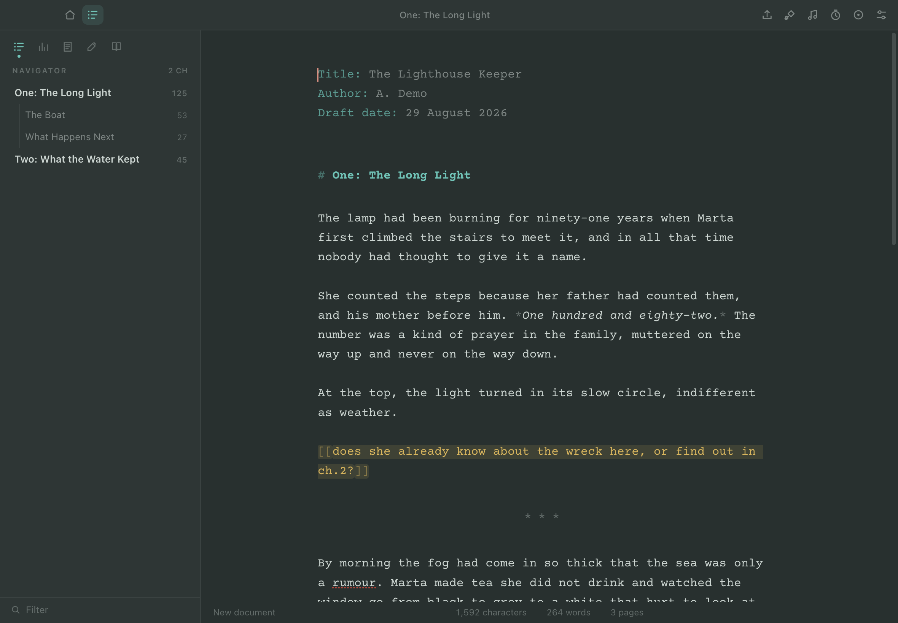
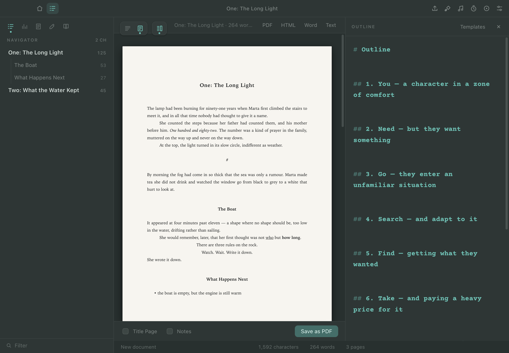
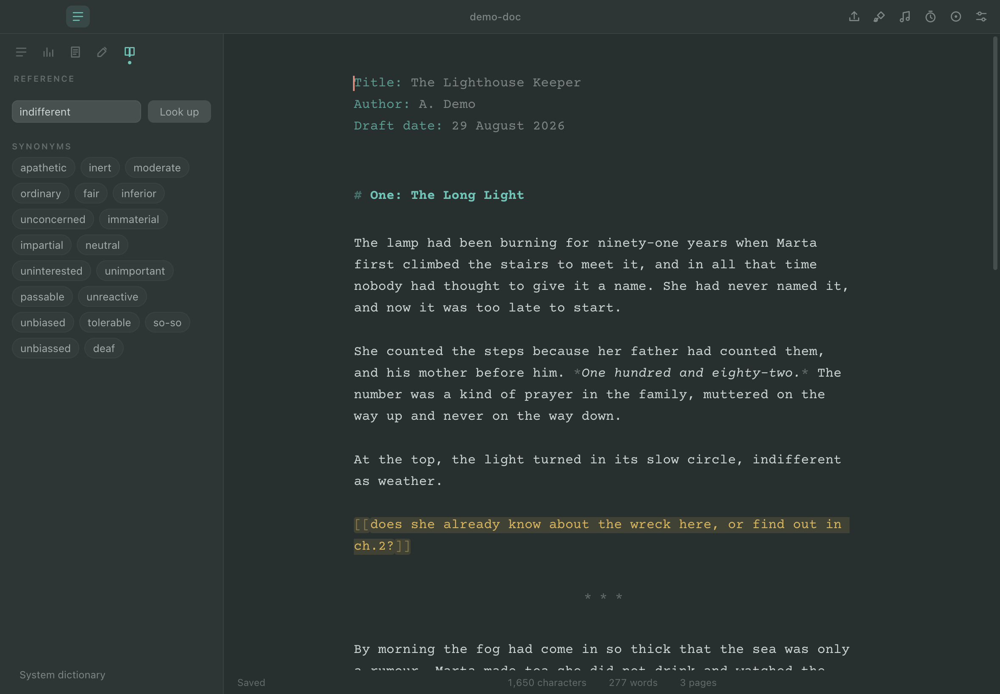
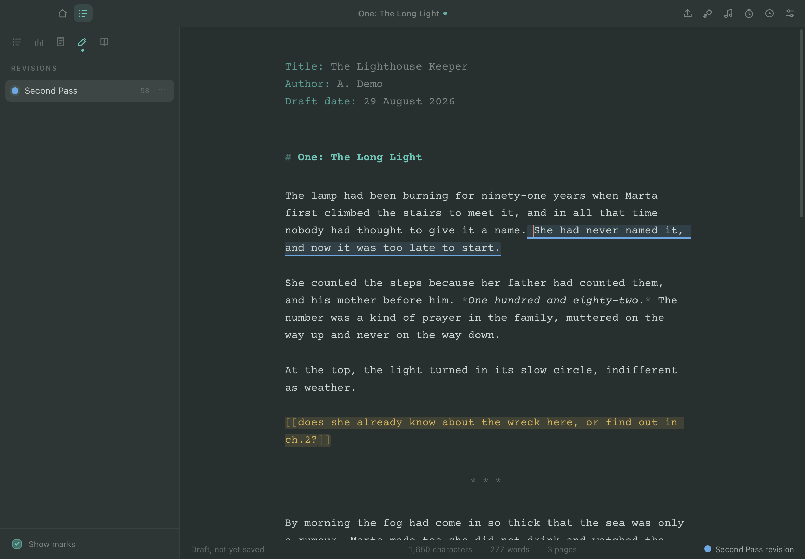
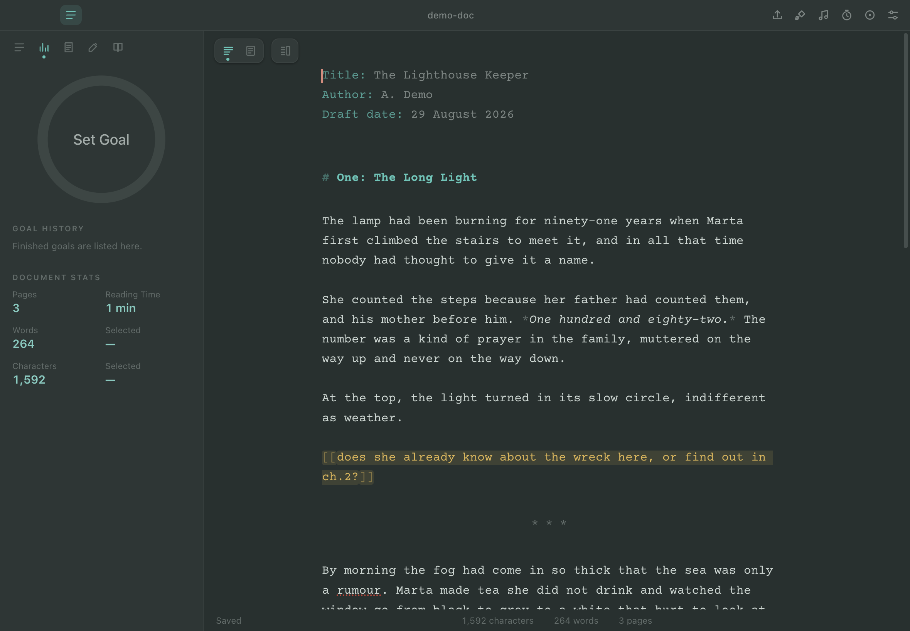
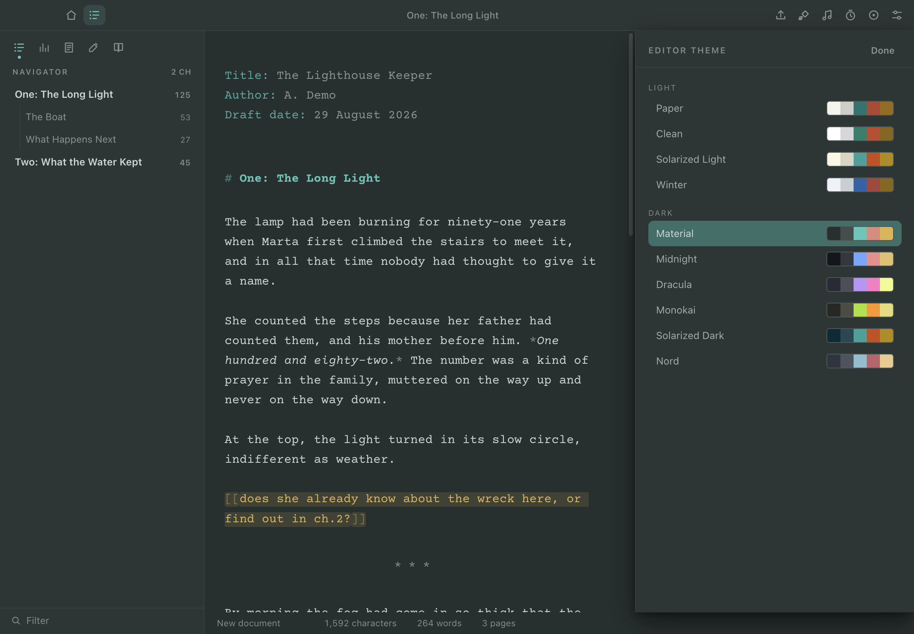

<p align="center">
  
</p>

<h1 align="center">Low Tide</h1>

<p align="center">A novel writing app that keeps you in the room.</p>

Writing goes wrong when you leave to look something up. You open a browser for a
synonym, glance at your outline in another window, put music on — and the thread
is gone. Low Tide puts all of it inside the app: your outline beside the page, a
dictionary and thesaurus in the sidebar, music in a pane, notes where you're
working. Nothing asks you to tab away.

The name is the promise. The tide is out; there's no water here to fall into.

Your document stays a plain `.fountain`, `.txt` or `.md` file the whole time.
No database, no lock-in, readable in any other editor.



## Install

### With Homebrew, on macOS

The tap is this repository, so there is one to add and then the usual two
commands. Updating never means downloading a disk image and dragging it over
the old copy again.

```bash
brew tap hrozno2/lowtide https://github.com/hrozno2/lowtide
brew trust hrozno2/lowtide
brew install --cask lowtide
brew upgrade --cask lowtide      # whenever there is a new one
```

`brew trust` is Homebrew asking whether you mean to run code from a tap that
is not its own; it is asked once.

On Homebrew 6 and older, add `--no-quarantine` to those last two. These builds
are not signed by a paid Apple developer account, and an unsigned app that
arrives carrying macOS's quarantine flag is refused as damaged. Homebrew 7
stopped quarantining casks and removed the flag, so passing it there is an
error instead — which is why the app tries it and drops it if this Homebrew
has never heard of it.

Low Tide offers this itself: when it finds a newer release and sees Homebrew
installed this copy, the notice reads **Update & Restart** and runs that
upgrade for you. If Homebrew ever wants an answer it cannot get from inside
the app, the same command is handed to Terminal where you can answer it.

### Download

Take the file for your machine from
[Releases](https://github.com/hrozno2/lowtide/releases).

| System | File |
| --- | --- |
| macOS, Apple silicon | `LowTide-‹version›-mac-arm64.dmg` |
| macOS, Intel | `LowTide-‹version›-mac-x64.dmg` |
| Windows | `LowTide-‹version›-win-x64.exe` |
| Linux, any distro | `LowTide-‹version›-linux-x86_64.AppImage` |
| Arch, CachyOS, Manjaro | `LowTide-‹version›-linux-x64.pacman` |

Everything but the macOS disk image can update itself afterwards; **Updates**
under [What's in it](#whats-in-it) says what each one does when a new release
appears. A disk image dragged to Applications cannot, which is what Homebrew
above is for.

- **macOS** — open the `.dmg`, drag it to Applications.
- **Windows** — run the `.exe`. It updates itself from then on: the app
  fetches the new installer and runs it, and nothing has to be downloaded by
  hand.
- **AppImage** — `chmod +x` it and run it. Nothing to install, and it replaces
  itself when a new release appears.
- **Arch** — `sudo pacman -U LowTide-‹version›-linux-x64.pacman`

The builds are not notarised, so the first launch needs a nudge: on macOS
right-click the app and choose **Open** (double-clicking will refuse); on
Windows choose **More info → Run anyway**.

### Or build it

```bash
git clone https://github.com/hrozno2/lowtide.git
cd lowtide
npm install
npm start
```

To make installers yourself:

```bash
npm run dist:mac      # .dmg                   (Apple silicon + Intel)
npm run dist:win      # installer              (x64 + arm64)
npm run dist:linux    # AppImage, pacman
```

Each has to run on that platform, or in CI.

## What's in it

**Writing.** Plain text with live styling — headings, emphasis, notes and
comments are coloured as you type, and the markup characters stay visible so the
page never reflows under your hands. Smart quotes, em dashes and ellipses.
Spellcheck with right-click corrections; choose your dictionaries in Preferences.

**Search.** The magnifying glass (or ⌘K) finds anything: a setting, a place
in the app — the scratchpad, the outline, themes, the pages view — or a menu
command, and choosing it goes there. It forgives typos, knows that *colour*
means Themes and *pomodoro* means the sprint, and when nothing matches it
offers the words it thinks you meant. Preferences itself is six folding
sections. Hold a toolbar button until the row shakes, then drag it to reorder.

**Structure.** The Navigator lists every chapter and section with its word
count, filters as you type, and jumps you there. Nesting is drawn with one rule
per level, and dragging a chapter reorders the manuscript — the text goes with
it, scenes and all.

**Outline.** A second editor beside the manuscript, opened and closed with one
button and resizable by dragging. Start from three-act, Dan Harmon's story
circle, the hero's journey, seven-point, Freytag, a chapter grid, or blank. Each
outline belongs to its document and stays open in both the text and pages views.



**Pages.** The pages view sets the manuscript as a trade paperback is set:
Amiri at 11.5pt on 145% leading in a 4.25in measure on a 6×9 trim, 31 lines to
a page, a centred running head, each chapter opening partway down the page and
flowing on rather than forcing a new one. That geometry puts a page at about
300 words, which is the number the trade works to — measured rather than
assumed: `scripts/wpp.js` lays 30,000 words of real novel prose out in the
exact print geometry and reads back what a page holds (307 Austen, 320 Doyle,
316 Melville). Amiri is bundled, so the page is the same on macOS, Windows and
Linux, and the PDF embeds it.

Whole pages can be chosen at once under Preferences → Page: **Trade
paperback**, **Mass market**, the page **Highland 2** draws (13pt on 20.8pt
lines in a 5.35in column on your region's paper, about 390 words a page), and
a double-spaced **submission manuscript**. Trim, margins, type size, leading,
justification and hyphenation are all still there one at a time, with a
Reset. Page markers, off by default, show where each printed page begins in
the margin of the writing view. Zoom the pages with ⌘+ and ⌘−, ⌘-scroll, or the −/+ under them; ⌘0 fits
the page. The PDF is the preview, at the trim you chose.

**Reference.** Definitions, synonyms and antonyms in the sidebar. Click a
synonym to swap it into your prose. On macOS the system dictionary is one click
away and works offline.



**Sound.** Play audio files from your machine, or browse YouTube in a pane,
repainted in your theme with the comments, likes, recommendations and shorts
stripped out, which leaves the search box and the player. Closing the pane
hides it rather than stopping it, so whatever is playing keeps playing.
YouTube can be switched off entirely.

**Scratchpad.** Notes about the document, kept with it, never printed or counted.

**Revisions.** Name and colour a revision; everything you type while it is
selected is marked in that colour, and the marks follow the text through later
edits. Any revision can be hidden, applied (keep the text, drop the colour),
reverted (delete what it added), or removed.



**Goals and stats.** One goal at a time — new words, new pages, total words or
total pages. Meet it, press Done, and it drops into the history. Alongside it:
pages, reading time, words, characters, and counts for whatever is selected.
Sprints run a countdown with an optional word goal.



**Focus.** The focus button opens a small panel over the toolbar: dim
everything but where you are, choose whether the paragraph or the line stays
lit, and say whether the notes in your text are picked out in colour or dimmed
until you want them.

**Scrolling while you write.** The page follows the caret only when it comes
near an edge, and then leaves a fifth of the window below it to write into,
rather than letting the line you are on sit on the last pixel of the window.
*Snap to the caret* in Preferences goes back to keeping it hard against the
edge; *Typewriter scrolling* holds it in the middle instead — the caret only,
so selecting with the mouse is left alone.

**Notes to yourself.** `[[a note in double brackets]]` and `/* a comment
block */` sit in the manuscript without ever being counted or printed. They
take a colour of their own from the theme, and dim out of the way when you
would rather not see them.

**Preview and export.** Real page breaking — the manuscript is laid out
offscreen at print geometry and cut where the lines actually fall, so the page
count is the true one. Export to PDF, Word (`.docx`, written directly rather
than HTML in disguise), Markdown, plain text or HTML, with an optional title
page.

**Goals and sprints.** Set a word or page goal from the ring in the sidebar;
the ones you meet are kept, the ones you give up on are not. A goal belongs to
the manuscript it was set for, so each project shows its own days and nobody
else's. Every sprint is
recorded whether it ran its course or not. *View all* under the recent goals
opens the record of both — what each day came to, how long you sprinted, and
how much of it was words. Strike an entry out with the × beside it, or keep
the lot as a PDF, as a table or as a grid of cards.

**It travels with the manuscript.** Beside every saved document is a
`.lowtide` companion holding its outline, scratchpad, revisions, the caret's
last position, and the goal and sprint history it was written under. Whatever syncs your manuscript syncs
that with it, so opening the file on another machine brings its history along
and joins it to whatever that machine already knew — the same day recorded
twice stays one day. Switch it off in Preferences if you would rather have
nothing beside the file.

**Where it lives.** The save state in the status bar is a button: it tells you
the file this window is writing to, offers to copy the path, and opens the
folder it is in.

**Nothing gets lost.** Saves are atomic, so a crash cannot truncate your file.
It saves as you write — silently, with nothing to dismiss — when you pause and
at least every fifteen seconds while you keep going; both the switch and the
interval are in Preferences. A version of the manuscript is kept every few
minutes and whenever the file is saved over, and `File ▸ Version History` opens
any of them in a new window, the current document untouched. The store holds
every recent version and a day's last beyond those, so a history outlives the
week it was written in; it lives beside your settings, not in the app, so
updating never touches it, and versions kept before you moved or renamed a
manuscript are listed with it. Unsaved drafts survive a restart.
`File ▸ Move to Dropbox` moves a document into Dropbox with its outline,
scratchpad and revisions intact.

**Updates.** On launch it asks GitHub whether a newer release exists and, if
so, shows a dismissible notice. What the notice offers depends on how the copy
was installed, and none of it happens without a click:

| Installed as | The notice offers |
| --- | --- |
| Homebrew cask (macOS) | running `brew upgrade --cask lowtide` itself, then restarting — see [Install](#with-homebrew-on-macos) |
| Windows installer | fetching the new installer and running it |
| AppImage (Linux) | replacing the AppImage in place |
| pacman package (Arch) | `pacman -U` on the new package, behind the system's password prompt |
| a disk image dragged to Applications | a download link, since there is nothing to upgrade in place |

The check can be switched off in Preferences.

**Out of the way.** Preferences, export, themes, the sprint timer and the rest
open as a panel down the right and the text moves over to make room, so nothing
ever covers the line you are writing. Every theme is checked against WCAG
contrast ratios, so all of them are readable rather than only most of them.

**Make it yours.** Ten themes, light and dark. Typeface, size, line spacing,
column width, page size, margins and print leading are all adjustable, and the
toolbar buttons can be reordered or switched off. On Windows and Linux the menu
is either a button in the title bar or written out along it, whichever you
prefer — drawn in the theme either way rather than in the system's colours.
The taskbar/dock icon follows along too, its mark recoloured to match.



## The markup

| You write | You get |
| --- | --- |
| `# Chapter One` | Chapter — appears in the Navigator |
| `## Scene` / `### Beat` | Section, sub-section |
| `**bold**` `*italic*` `***both***` | Emphasis |
| `_underline_` `~~struck~~` | Underline, strikethrough |
| `[[a note to self]]` | Note — never printed, never counted |
| `/* … */` | Comment — hidden from the manuscript |
| `===` | Page break |
| `***` or `---` | Scene break — drawn as a rule while you write |
| `> centered <` | Centered line |
| `- item` | Bulleted list |

A `Key: Value` block at the top of the file (`Title:`, `Author:`,
`Draft date:`) becomes the title page and is left out of the word count.

## Keyboard

| | |
| --- | --- |
| `⌘/Ctrl 1 2 3` | Chapter, Section, Sub-section |
| `⌘/Ctrl B I U` | Bold, italic, underline |
| `⇧⌘/Ctrl C` | Centre the line |
| `⇧⌘/Ctrl N` | Wrap in a note |
| `⌘/Ctrl F` | Find |
| `⌥⌘F` / `Ctrl H` | Find and replace |
| `⌘/Ctrl J` | Go to chapter |
| `⇧⌘/Ctrl L` | Navigator |
| `⇧⌘/Ctrl U` | Outline |
| `⇧⌘/Ctrl D` | Dictionary and thesaurus |
| `⇧⌘/Ctrl M` | Music |
| `⇧⌘/Ctrl E` | Pages view |
| `⌘/Ctrl K` | Search everything |
| `⇧⌘/Ctrl F` | Focus Mode |
| `⇧⌘/Ctrl T` | Typewriter scrolling |
| `⇧⌘/Ctrl R` | Sprint |
| `⌘/Ctrl E` | Export |
| `F1` | Markup cheat sheet |

## Notes

- Page counts come from a real layout rather than a words-per-page guess. Page
  size, margins, type size and leading are all adjustable.
- The PDF's running head is drawn by Chromium's print engine, which puts it on
  every page, including a title page. The on-screen preview is exact.
- The dictionary queries dictionaryapi.dev and datamuse.com. Only the single
  word is sent, the request comes from the main process rather than the editor,
  and the feature can be switched off.
- The music pane shows YouTube's own site, with its palette overridden to match
  the current theme. Taking only the audio is against their terms, so it is not
  done; use local files if you want sound with nothing to look at. There is no
  Spotify tab — its web player needs DRM that Electron does not ship.

## Known problems

**The view can jump after a long scroll.** Scroll a long way down a long
manuscript and then click, and the page may move somewhere else. The caret
goes where you clicked — that part is right — but the editor re-anchors its
viewport on the first update after the scroll, even though the document's
height has not changed (measured: 46,300 pixels before the click and 46,286
after, while the scroll position moved by 27,000). It is not caused by the
theme, the markup, or the way the writing column is centred: a plain document
with no headings or notes is worse, and reverting the column to how it was
laid out before changes nothing. Not yet fixed.

## Development

```bash
npm run watch       # rebuild the renderer as you edit
npm test            # 119 unit and 439 end-to-end checks
npm run pack        # unpacked build, the quickest packaging check
```

```
src/main/          windows, menus, file IO, PDF and Word export
src/renderer/js/   markup, decorations, pagination, parse, editor, app
src/renderer/css/  theme.css holds every palette token
```

## Licence

MIT — see `LICENSE`. Everything bundled is permissively licensed, with the full
text in `THIRD-PARTY-NOTICES.md`. CodeMirror, Electron, esbuild and
electron-builder are MIT; Courier Prime and Amiri are under the SIL Open Font
License, Amiri subset to the Latin ranges.

Every icon, style and string here was written for this project; it is not
derived from any other application's code or assets. Fountain is an open syntax.
